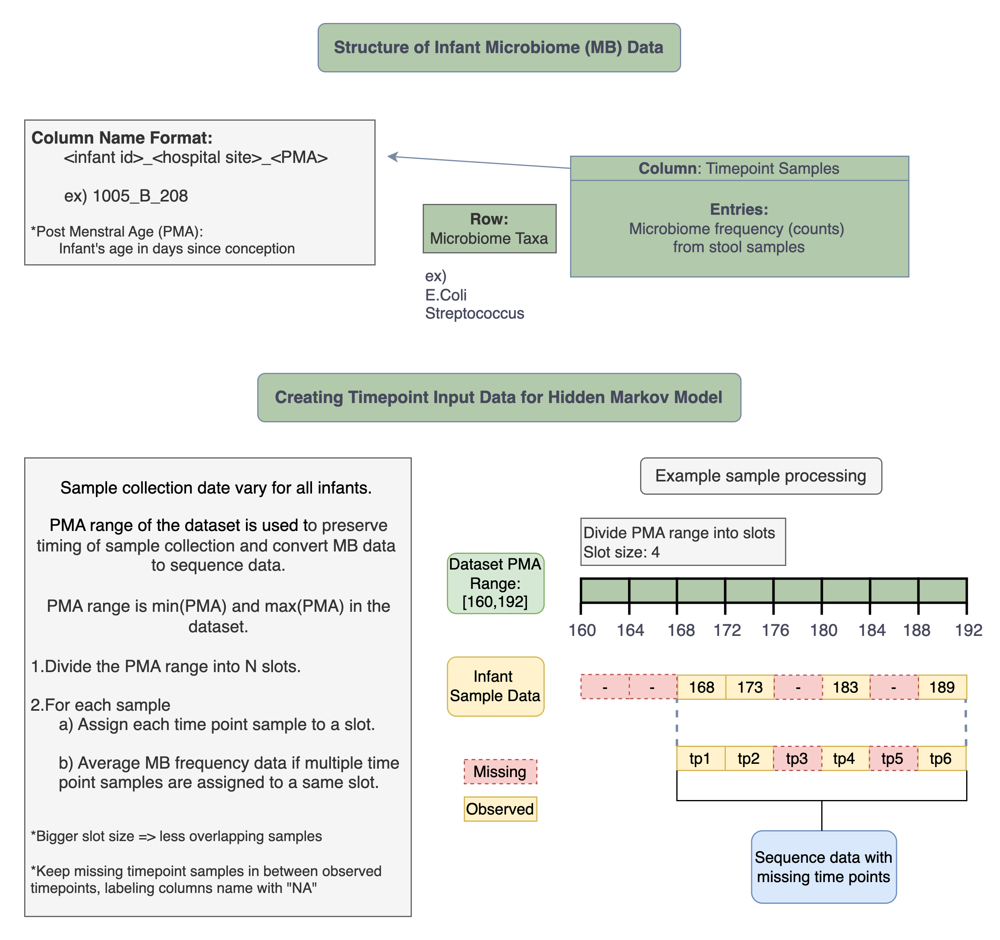
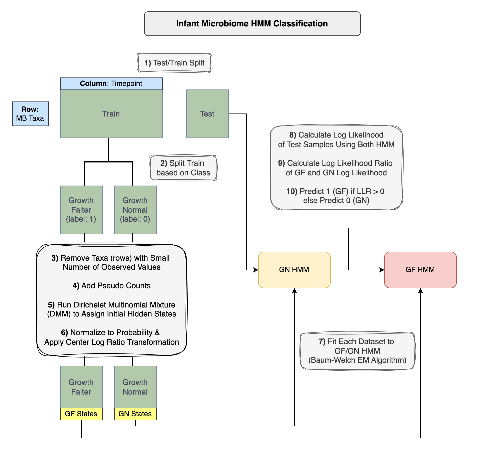

```
python 3.8
```
This project is a Gaussian Emission Hidden Markov Model (HMM) binary classifier that predicts preborn infants (prematurely born babies) as growth normal (GN) or growth faltering (GF) using infants' gut microbiome (MB) community data collected over time. Two HMMs are trained on GN and GF infant MB data separately. Log likelihoods (probability of observations; P(O)) of test data are calculated using GF/GN HMMs, classifiying the samples as GF or GN based on higher P(O) each HMM outputs.

Infant microbiome data was collected at multiple post menstral age (PMA; infant's age in days since conception) of the infants. Because samples were collected at varying PMAs, there are missing as MB data is converted into sequence data. HMM is modified to handle missing timepoint data; emission probability at missing timepoint is converted to 1 and so only the transition probability at such timepoint will affect state assignments.

Initial hidden states are assigned using R Bioconductor's DMM - Software for fitting Dirichlet multinomial mixtures (DMM) to microbial communities, which is a clustering probabilistic method for community detection in microbial samples.

### Input data:
* Input data is Operational taxonomic unit (OTU) table csv file.
* OTU table contains abundance of bacteria taxa

### Notebook Running Order:
1. infant_mb_data_preprocess.ipynb
1. infant_mb_hmm.ipynb OR infant_mb_hmm_loocv.ipynb
* infant_mb_hmm.ipynb splits test/train with ratio.
* infant_mb_hmm_loocv.ipynb uses Leave-One-Out-Cross-Validation method.

&nbsp; 
### infant_mb_data_preprocess.ipynb Flowchart:


### infant_mb_hmm.ipynb Flowchart:


### File System After Running Notebooks
```
├── output
│   ├── gf.csv
│   ├── gn.csv
│   ├── gf_state_assignments.csv
│   ├── gn_state_assignments.csv
│   └── output.log
├── data
│   ├── class_labels.tsv
│   ├── otu_table_sample.csv
│   └── merged_otu.csv
└── readme.md
```
### Dependencies
```
jupyternotebook
matplotlib                3.7.5
matplotlib-inline         0.1.7
numpy                     1.24.4
pandas                    2.0.3
rpy2                      3.5.11
scikit-bio                0.6.3
scikit-learn              1.3.2
scipy                     1.10.1

* R needs to be installed
```